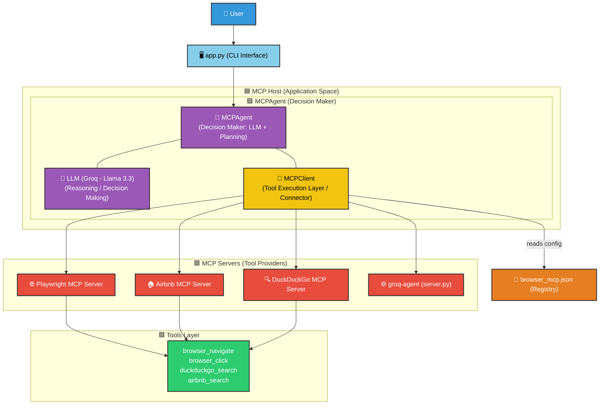

# 🚀 MCP Agent & Server Ecosystem

A state-of-the-art demonstration of the **Model Context Protocol (MCP)**, featuring autonomous agents, browser automation, and multi-server orchestration. This ecosystem leverage's Groq's high-performance inference to provide a seamless agentic experience.

---

## 🏗️ Architecture Overview

The system operates in two distinct modes. Below are the precise technical architectures for both the interactive CLI and the standalone MCP Server mode.

### 🎯 1. MCP Architecture - Direct CLI Mode (`app.py`)

In this mode, the user interacts directly with the terminal-based agent which handles reasoning and tool execution in a single host process.



---

### 🎯 2. MCP Architecture - Server Mode (`server.py`)

In this mode, the project acts as an MCP server itself, exposing its capabilities to external clients like VS Code Copilot.

```mermaid
graph TD
    %% Color Definitions
    classDef blue fill:#3498db,stroke:#333,stroke-width:2px,color:#fff
    classDef lightblue fill:#87ceeb,stroke:#333,stroke-width:2px,color:#000
    classDef purple fill:#9b59b6,stroke:#333,stroke-width:2px,color:#fff
    classDef yellow fill:#f1c40f,stroke:#333,stroke-width:2px,color:#000
    classDef orange fill:#e67e22,stroke:#333,stroke-width:2px,color:#fff
    classDef red fill:#e74c3c,stroke:#333,stroke-width:2px,color:#fff
    classDef green fill:#2ecc71,stroke:#333,stroke-width:2px,color:#fff

    Ext["🌐 External Client<br/>(Caller of MCP Server)"]:::blue
    
    subgraph ServerHost ["🟦 MCP Host (server.py)"]
        Server["⚙️ server.py (FastMCP Server)"]:::lightblue
        Task["🛠️ run_task(query)"]:::lightblue
        
        subgraph AgentBoxServer ["🟪 MCPAgent"]
            AgentS["🤖 MCPAgent<br/>(Decision Maker)"]:::purple
            LLM S["🧠 Groq LLM"]:::purple
            ClientS["🔌 MCPClient<br/>(Tool Connector)"]:::yellow
            AgentS --- LLMS
            AgentS --- ClientS
        end
    end

    ConfigS["📄 browser_mcp.json"]:::orange
    
    subgraph ServersBoxServer ["🟥 MCP Servers (Tool Providers)"]
        PWS["🌐 Playwright"]:::red
        ABS["🏠 Airbnb"]:::red
    end

    subgraph ToolsBoxServer ["🟩 Tools"]
        TS["browser, search, etc."]:::green
    end

    %% Logical Connections
    Ext -->|Calls run_task| Server
    Server --> Task
    Task --> AgentS
    ClientS -->|reads config| ConfigS
    ClientS --> PWS
    ClientS --> ABS
    PWS --> TS
    ABS --> TS
```

---

## ✨ Key Features

- **⚡ High-Performance Inference**: Powered by Groq's `llama-3.3-70b-versatile` for near-instantaneous reasoning.
- **🌐 Autonomous Browser Control**: Deep integration with Playwright for navigating and interacting with the web.
- **🔌 Flexible Server Protocol**: Connects to any standard MCP server for extensible tool capabilities.
- **📂 State-Aware Memory**: (In `app.py`) Maintains conversation state to handle complex, iterative requests.
- **🛠️ Custom Server Extension**: Includes its own `FastMCP` server for wrapping agentic workflows as reusable tools.

---

## 📂 Project Structure

| Component | Responsibility |
| :--- | :--- |
| `app.py` | The flagship CLI chat interface and agent controller. |
| `server.py` | A `FastMCP` server implementation providing the `run_task` tool. |
| `browser_mcp.json` | The core registry for all connected MCP services. |
| `pyproject.toml` | Project dependencies managed via Python's `uv` tool. |
| `.env` | Secure storage for sensitive API keys. |

---

## 🛠️ Getting Started

### 1. Environment Setup
Ensure you have [uv](https://github.com/astral-sh/uv) installed and a valid Groq API key.

```bash
# Clone the environment variables
echo "GROQ_API_KEY=your_key_here" > .env
```

### 2. Launch the Ecosystem
You can interact with the agent directly or run the custom server.

**Start the Interactive Agent:**
```bash
python app.py
```

**Expose the Custom MCP Server:**
```bash
python server.py
```

---

## 📖 Implementation Notes
The ecosystem is built on the `mcp_use` library, bridging LangChain components with the Model Context Protocol. The `MCPAgent` is configured with safety rails like `max_steps` to prevent infinite loops during autonomous execution.

---

**🔥 MCP enables a single agent to interact with multiple tool providers via standardized servers.**

---

*Note: The previous `mcp.json` was detected as missing or redundant; all core configuration is now consolidated in `browser_mcp.json`.*

---

Made with ❤️ for the MCP Community
