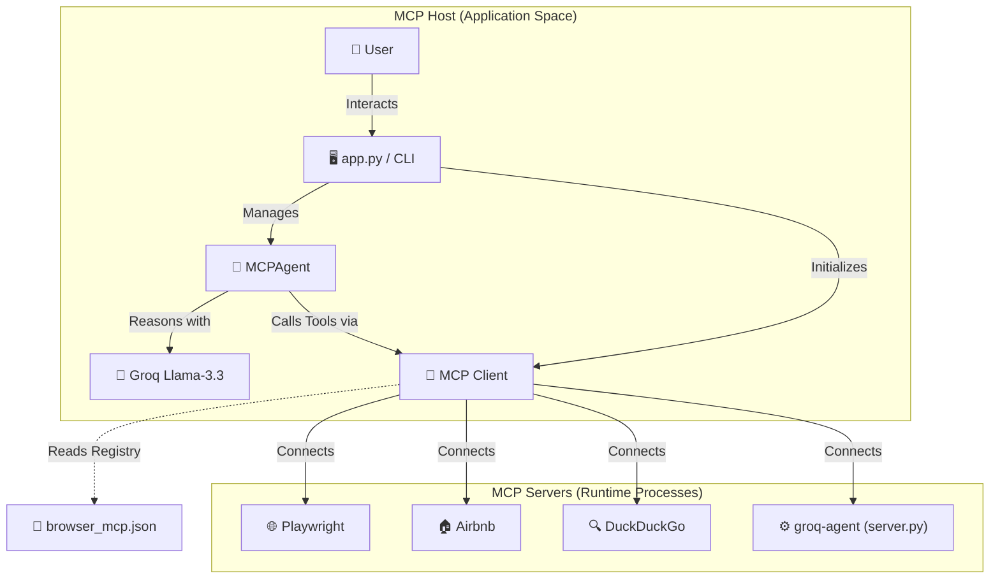

# 🚀 MCP Agent & Server Ecosystem

A state-of-the-art demonstration of the **Model Context Protocol (MCP)**, featuring autonomous agents, browser automation, and multi-server orchestration. This ecosystem leverage's Groq's high-performance inference to provide a seamless agentic experience.

---

## 🏗️ Architecture Overview

The project is structured into three distinct regions: the **MCP Host (App)**, the **Registry**, and the **MCP Servers (Processes)**.



---

## ✨ Key Features

- **⚡ High-Performance Inference**: Powered by Groq's `llama-3.3-70b-versatile` for near-instantaneous reasoning.
- **🌐 Autonomous Browser Control**: Deep integration with Playwright for navigating and interacting with the web.
- **🔌 Flexible Server Protocol**: Connects to any standard MCP server for extensible tool capabilities.
- **📂 State-Aware Memory**: (In `app.py`) Maintains conversation state to handle complex, iterative requests.
- **🛠️ Custom Server Extension**: Includes its own `FastMCP` server for wrapping agentic workflows as reusable tools.

---

## 📂 Project Structure

| Component | Responsibility |
| :--- | :--- |
| `app.py` | The flagship CLI chat interface and agent controller. |
| `server.py` | A `FastMCP` server implementation providing the `run_task` tool. |
| `browser_mcp.json` | The core registry for all connected MCP services. |
| `pyproject.toml` | Project dependencies managed via Python's `uv` tool. |
| `.env` | Secure storage for sensitive API keys. |

---

## 🛠️ Getting Started

### 1. Environment Setup
Ensure you have [uv](https://github.com/astral-sh/uv) installed and a valid Groq API key.

```bash
# Clone the environment variables
echo "GROQ_API_KEY=your_key_here" > .env
```

### 2. Launch the Ecosystem
You can interact with the agent directly or run the custom server.

**Start the Interactive Agent:**
```bash
python app.py
```

**Expose the Custom MCP Server:**
```bash
python server.py
```

---

## 📖 Implementation Notes
The ecosystem is built on the `mcp_use` library, bridging LangChain components with the Model Context Protocol. The `MCPAgent` is configured with safety rails like `max_steps` to prevent infinite loops during autonomous execution.


---

Made with ❤️ for the MCP Community
